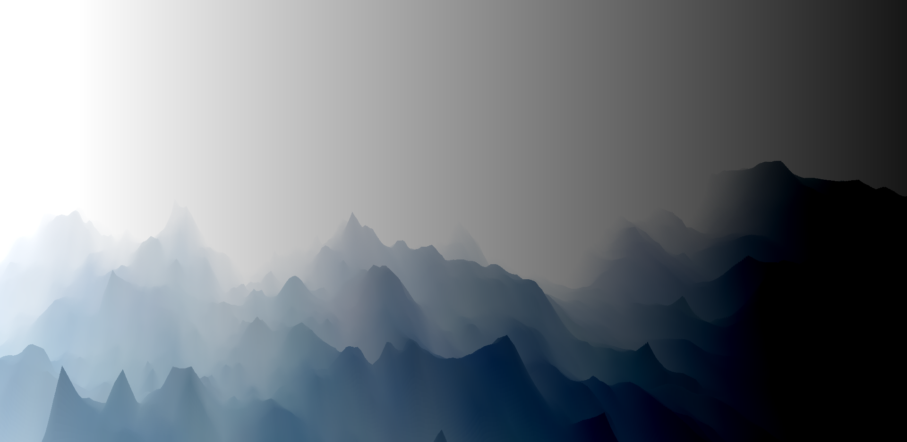
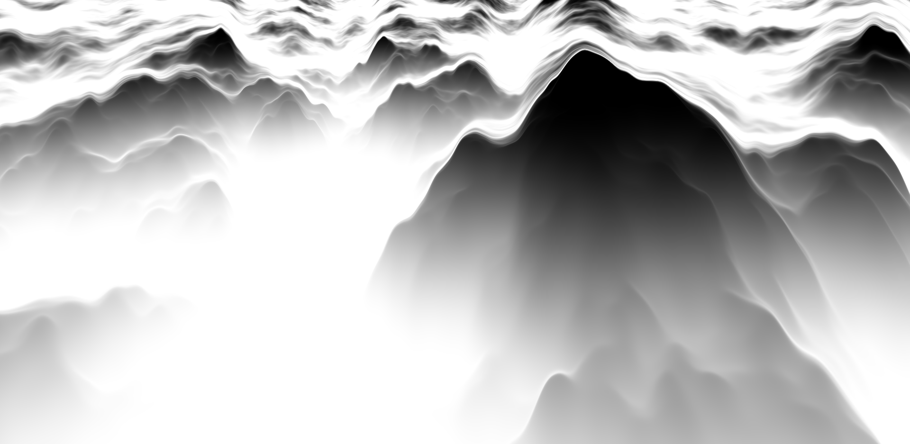
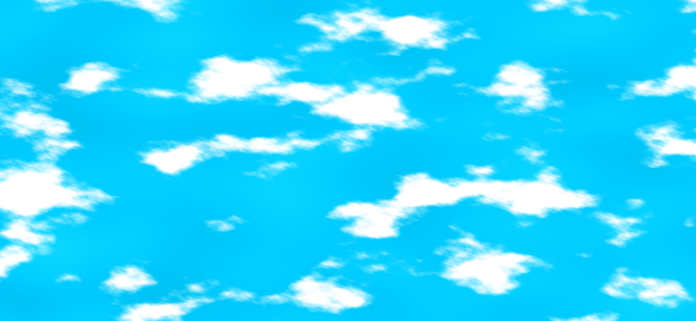
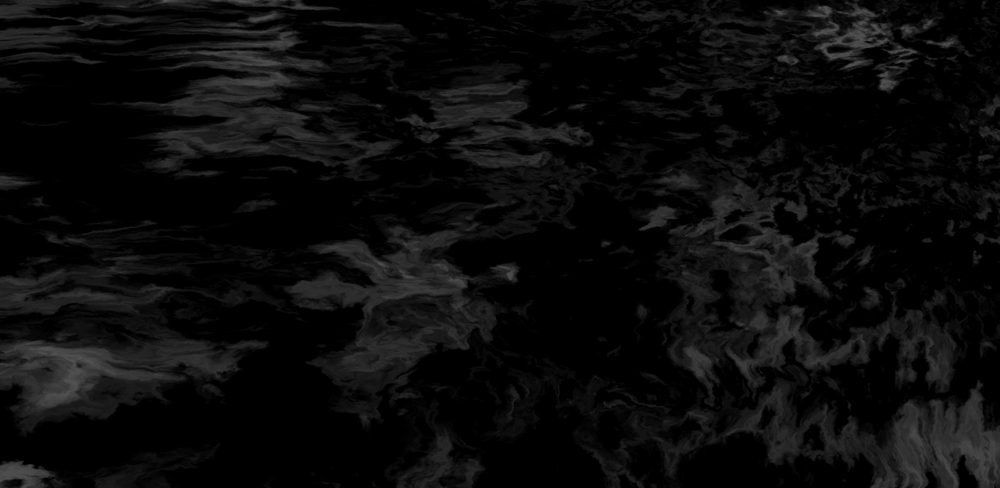
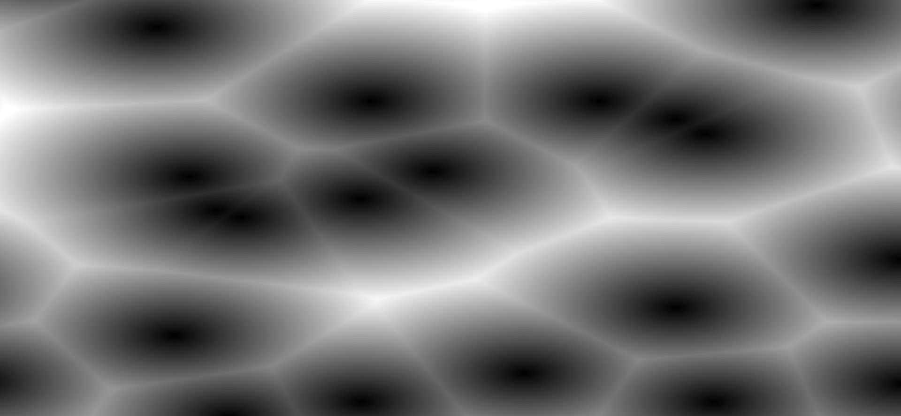

# 一些有趣的web动画效果

## canvas

- 2d  
- webgl
  - shader_groud   一些练习的fragment shader

> mountain.frag

>simple_sdf_fbm_raymarching.frag

>fBm.frag

>domain_warping.frag

>cellular_noise.frag

## css

## 辅助

- [避免跨域，简易服务器](./server.js)